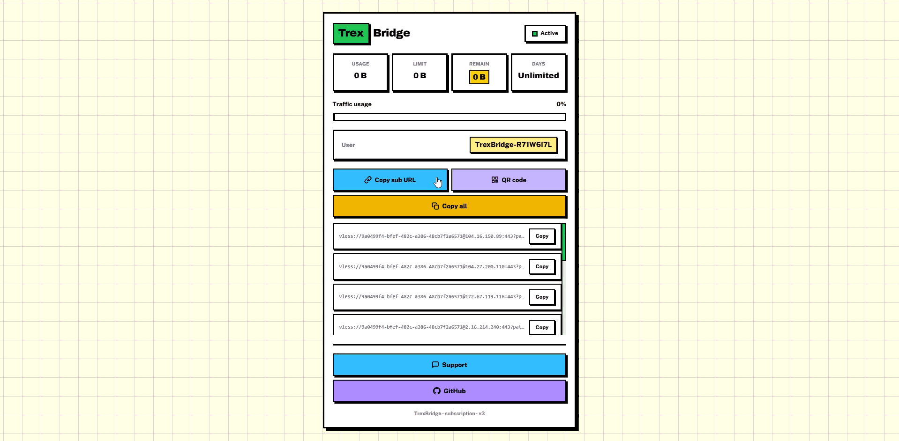
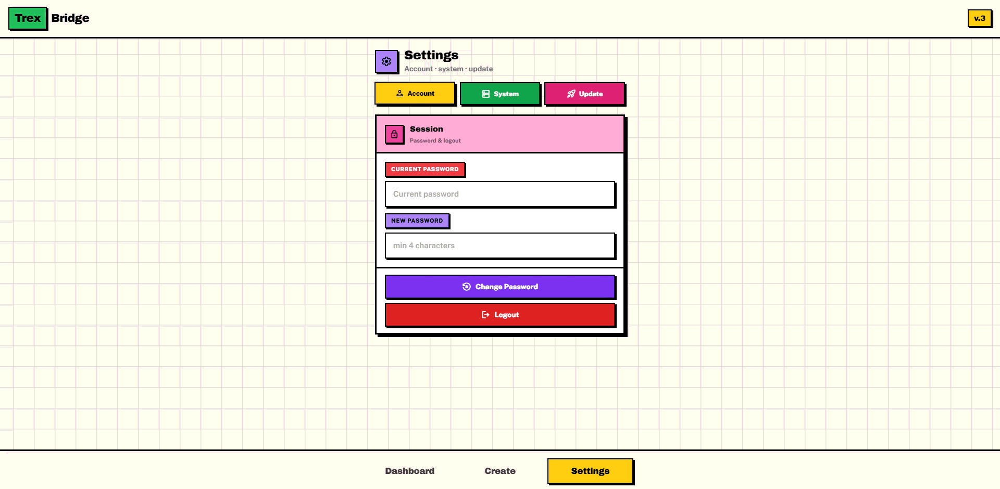
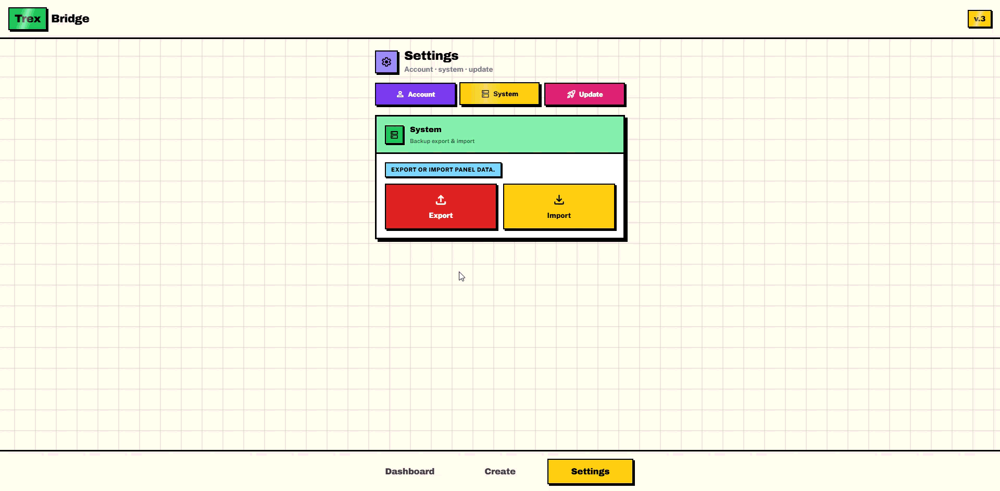
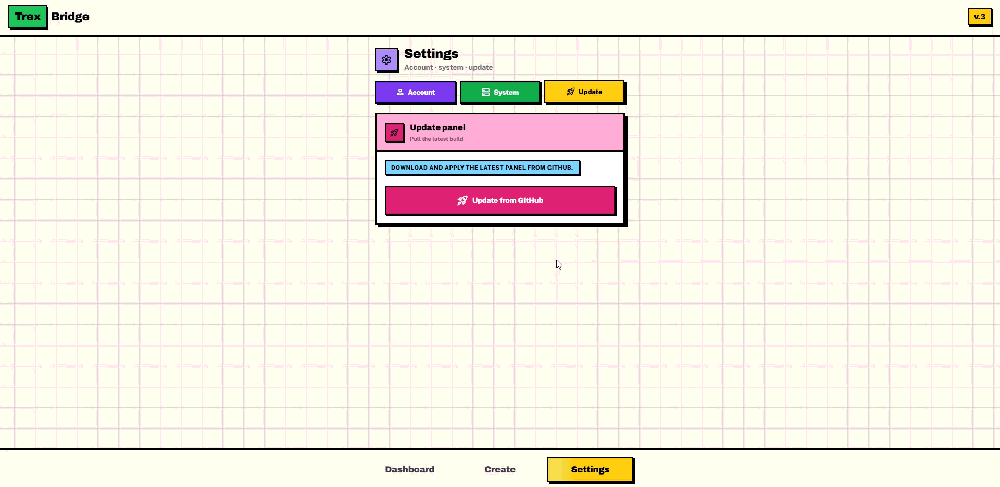

<div align="center">


# **TrexBridge**

**A modern, fast and powerful management panel built entirely on Cloudflare Workers**

[](https://t.me/TrexBridgePanel)
[](https://t.me/TrexBridgePanelBot)
[](LICENSE)
[](https://workers.cloudflare.com)
[](#)
[](#)
</div>

> [!CAUTION]
> **This project is intended for educational and personal testing purposes only.**  
> **Please use it responsibly and do not engage in any illegal activity.**  
> **TrexBridge is completely free and is not for sale.**

**TrexBridge** is a next-generation proxy management panel designed from the ground up to run completely on **Cloudflare Workers**.  
**It removes the need for a traditional VPS and brings high performance, global availability, low latency, and near-zero operational cost to user management.**

**The project was created with a strong focus on real-world conditions, especially the Iranian network environment.**  
**It comes with a powerful Clean IP system, advanced fragmentation, real-time traffic control, and a beautiful modern interface.**

**Whether you need a simple personal panel or a multi-user service, TrexBridge offers a clean, modern and reliable solution without the complexity of traditional panels.**

---

## **📖 Philosophy Behind TrexBridge**

**Most proxy panels require a VPS, constant maintenance, complex configurations, and ongoing costs.**  
**TrexBridge takes a completely different path:**

- **Everything runs on Cloudflare’s global edge network**
- **No server to manage or secure**
- **Extremely fast response times worldwide**
- **Automatic scaling with zero effort**
- **Built-in D1 database**
- **Beautiful and modern user interface**

**The goal was to create something that feels simple to install, easy to use, and powerful enough for serious daily usage.**

**Traditional panels often force users to deal with:**

- **Server setup and security hardening**
- **Firewall configuration**
- **Certificate management**
- **High monthly costs**
- **Complex update processes**

**TrexBridge eliminates almost all of these problems by leveraging the power of Cloudflare Workers.**  
**The entire system (backend, frontend, and database) lives inside a single Worker script.**  
**This architecture makes the panel extremely lightweight, highly available, and easy to maintain.**

---

## **✨ Features**

### **Core Capabilities**

| **Feature**          | **Description**                                      |
| -------------------- | ---------------------------------------------------- |
| **VLESS + Trojan**   | **Full support for both protocols over WebSocket**   |
| **Multi Port**       | **Assign multiple ports to each user**               |
| **Traffic Control**  | **Real-time volume tracking with hard limits**       |
| **Request Limit**    | **Control the number of connections and requests**   |
| **Expiry System**    | **Automatic account expiration based on days**       |
| **Online Detection** | **See which users are currently connected**          |
| **IP Limit**         | **Restrict the number of simultaneous IPs per user** |

### **🌍 Clean IP System**

**TrexBridge includes a carefully maintained Clean IP database optimized for Iranian ISPs.**

| **Operator**             |
| ------------------------ |
| 📶 **Irancell**          |
| 📱 **MCI (Hamrah Aval)** |
| 📡 **Rightel**           |
| 🌐 **Shatel**            |
| ☎️ **Telecom**           |
| 🏢 **Asiatech**          |
| 🧵 **Fiber**             |
| 📞 **Aptel**             |
| 🛰️ **Samantel**          |
| 🚀 **Pishgaman**         |

**You can select IPs by specific operator or use the All mode.**  
**The panel also supports automatic IP rotation on a customizable schedule.**

**Clean IPs play a critical role in improving connection stability and reducing the chance of being blocked.**  
**The system is designed so that even non-technical users can easily apply the best IPs for their network.**

### **🧩 Fragment System**

**Advanced fragmentation is built-in to help with deep packet inspection and network restrictions:**

- **Default** — **Standard Xray fragment for normal networks and everyday use**
- **Flux** — **Dual fragment mode (`fragment` + `fragment2`) for stronger bypass under heavier DPI**

**Fragmentation splits traffic into smaller pieces so restrictive networks have a harder time detecting and blocking the connection.**  
**Flux applies a fixed dual-fragment profile on every generated config when that mode is selected.**

### **User Experience**

- **Modern and clean admin dashboard**
- **Beautiful subscription / status page for end users**
- **Ad blocker**
- **NSFW filter**
- **SOCKS5 / HTTP proxy support with auto rotation**

**The interface follows a modern design language with clear visual hierarchy, soft colors, and smooth interactions.**  
**Both the admin panel and the user status page are fully responsive.**

---

## **🖼 Gallery**

### **Create One**

**Step-by-step user creation and config generation.**

<div align="center">

</div>

### **Quick User**

**One-tap quick user creation from the dashboard.**

<div align="center">

</div>

### **Subscription**

**Open the subscription page and check live status.**

<div align="center">

</div>

### **Change Password**

**Update the admin password from panel settings.**

<div align="center">

</div>

### **Export / Import**

**Backup panel data or restore from an export file.**

<div align="center">

</div>

### **Update Panel**

**Pull the latest panel build from GitHub.**

<div align="center">

</div>

---

## **🛁 Installation**

**Installation is done only through the official Deploy Bot.**

| **Step** | **Action** |
| -------- | ---------- |
| **1** | [](https://t.me/TrexBridgePanelBot) |
| **2** | [](https://t.me/TrexBridgePanel) |
| **3** | [](https://dash.cloudflare.com/profile/api-tokens) |
| **4** | **Send the token to the bot** |

**The bot will automatically:**

- **Create a new Cloudflare Worker**
- **Create and bind a D1 database**
- **Deploy the complete panel**
- **Enable the workers.dev subdomain**
- **Send you the panel link**

> [!WARNING]
> **Never use your main or important Cloudflare account for testing.**

---

## **📂 Project Structure**

```text
TrexBridge/
├── README.md
├── LICENSE
├── src/
│   └── Panel.js          # Main Cloudflare Worker
├── data/
│   └── CleanIP.json      # Clean IP database for Iranian ISPs
└── assets/
    ├── logo.png
    ├── Create-One.gif
    ├── Quick-User.gif
    ├── Subscription.gif
    ├── Change-Password.gif
    ├── Export-Import.gif
    └── Update-Panel.gif
```

---

## **🪖 How It Works**

**TrexBridge runs entirely as a single Cloudflare Worker.**

| **Step** | **Process** |
| -------- | ----------- |
| **1** | **Receives the WebSocket upgrade request** |
| **2** | **Authenticates the user using UUID** |
| **3** | **Checks traffic, request and expiry limits** |
| **4** | **Applies Clean IP or proxy settings** |
| **5** | **Applies fragmentation rules** |
| **6** | **Tracks real-time traffic and online status** |

**Both the admin panel and the user status page are served directly from the same Worker.**

| **Advantage** | **Description** |
| ------------- | --------------- |
| **Simple** | **No need for multiple services** |
| **Fast** | **Extremely low latency** |
| **Flexible** | **Easy to update** |
| **Safe** | **Easy to backup** |
| **Cheap** | **Very low cost** |

---

## **🔧 Tech Stack**

| **Layer**     | **Technology**                      |
| ------------- | ----------------------------------- |
| **Runtime**   | **Cloudflare Workers**              |
| **Database**  | **Cloudflare D1**                   |
| **Protocols** | **VLESS & Trojan (WebSocket)**      |
| **Frontend**  | **Vanilla JavaScript + Modern CSS** |
| **Storage**   | **In-memory Maps + D1**             |

**The panel avoids heavy frameworks on purpose.**  
**Using vanilla JavaScript keeps the Worker size small and the performance high.**

---

## **🔒 Security Notes**

- **Panel access is protected by password**
- **Sessions are handled securely**
- **Login attempts are rate-limited**
- **Never commit Cloudflare tokens to the repository**

> [!CAUTION]
> **CRITICAL SECURITY NOTE:**  
> **Save the admin password you set on first login in a safe place. If you lose it, recovery may not be possible.**

**Even though the panel runs on Cloudflare’s infrastructure, users are still responsible for protecting their panel password and Cloudflare API tokens.**

---

## **⚡ Performance**

**Because TrexBridge runs on Cloudflare’s edge network:**

- **Latency is extremely low in most regions**
- **The panel scales automatically**
- **There is no need to worry about CPU or memory limits in normal usage**
- **Cold starts are minimal thanks to the lightweight design**

**The architecture is optimized for both personal use and moderate multi-user scenarios.**

---

## **💖 Support the Project**

**If you find TrexBridge useful, consider supporting its continued development.**

| **Network**        | **Address**                                        |
| ------------------ | -------------------------------------------------- |
| **Bitcoin (BTC)**  | `bc1qx48j9lj989y5c9z8ewpgul2ed69mr50j97a0sk`       |
| **Ethereum (ETH)** | `0xF2ba522fD846F83D84131D433f56F885740cFc47`       |
| **Litecoin (LTC)** | `ltc1qh6y8ld27fdleuy3r7gykxxg38rkawl7adzc0dw`      |
| **Gram (TON)**     | `UQBGN4jXPW44cWQ20EGWqX7sU6K4RlYbnolc3IHoT3UWtmvW` |

> **Double-check the network before sending any funds.**

---

## **⭐ Star History**

<a href="https://www.star-history.com/?repos=icubaby%2Ftrexbridge&type=date&logscale=&legend=top-left">
 <picture>
   <source media="(prefers-color-scheme: dark)" srcset="https://api.star-history.com/chart?repos=icubaby/trexbridge&type=date&theme=dark&logscale&legend=top-left" />
   <source media="(prefers-color-scheme: light)" srcset="https://api.star-history.com/chart?repos=icubaby/trexbridge&type=date&logscale&legend=top-left" />
   
 </picture>
</a>

---

## **📄 License**

[](LICENSE)

**This project is licensed under the MIT License.**  
**You are free to use, modify, and distribute it as long as the original license is included.**

**Copyright © 2026 TrexBridge**  
**All rights reserved.**
